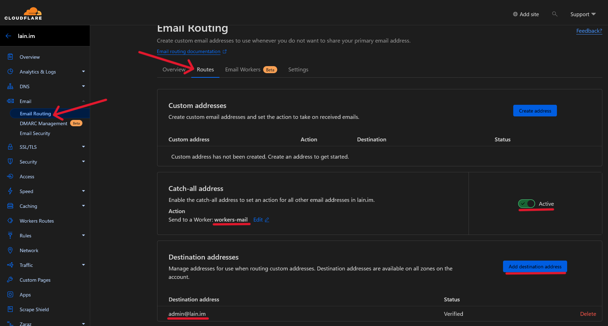

# Workers Mail

Workers Mail は、 Cloudflare Workers 上で独自ドメインの電子メール ホスティングを行うアプリケーションです。 API とフロントエンドを提供しており、簡単にあなたのドメイン名のメールアドレスを管理できます。  

メールの送受信には Cloudflare の [Email Routing](https://developers.cloudflare.com/email-routing/email-workers/) 機能を使用します。

## Demo
[Workers Mail(mail.lain.im)](https://mail.lain.im/)  

https://github.com/shinosaki/workers-mail/assets/88357168/59d76515-708c-41e5-850d-5bffee8a5f7b

## ToDo
- [x] メール作成
- [x] メール送信
- [ ] ラベリング
- [ ] メッセージ検索
- [ ] アクセスログ
- [ ] エンドツーエンド暗号化 (ProtonMail-like)

## Web UI
~~Web UIは [SvelteKit](https://kit.svelte.dev/) と [Tailwind CSS](https://tailwindcss.com/) で構築されたシングルページアプリケーションです。~~  

### NoJSバージョン
Workers Mailには、JavaScriptが無効な環境でも動作するNoJSバージョンのWeb UIが存在します。  
Tor BrowserをSafest設定で使用している場合は、NoJSバージョンでの利用を推奨します。

## API
APIは [Hono](https://hono.dev/) を利用しています。 Hono は Cloudflare Workers などのエッジ環境で API などを構築するためのフレームワークです。

~~API ドキュメントは [API.md](./docs/API.md) を参照してください。~~  

## 設定
環境に合わせて`wrangler.toml`の内容を編集してください。

### `[route]`
- `pattern`: WorkerにアクセスするためのURL(例: `mail.example.com`)
- `custom_domain`: `pattern`を設定するなら`true`

Workerに`*.workers.dev`というアドレスを割り当てたくない場合、`workers_dev`に`false`を設定してください。

### `[vars]`
Workerの環境変数です。  
新規登録や送信機能を一時的に許可・拒否したい場合は、Cloudflareのダッシュボードから環境変数を変更することも可能です。

| 変数名 | 値 | 説明 |
| --- | --- | --- |
| `CATCH_ALL_ADDRESS` | `"admin@example.com"` | 設定されている場合、存在しないユーザ宛てのメールをこのアドレスに転送します。 |
| `EMAIL_DOMAINS` | `[ "hello.com", "world.jp" ]` | 設定したドメイン名のメールアドレスを利用できます。 |
| `REGISTRATION` | `true` or `false` | 新規登録を許可する場合`true`(規定値は`false`)。 |
| `SENDING` | `true` or `false` | メールの送信を許可する場合`true`(規定値は`false`)。 |
| `DKIM_SELECTOR` | 任意の半角英数文字列 | DKIMのセレクタ名 |
| `DKIM_PRIV_B64` | Base64エンコードされたDKIM秘密鍵 | 特別な理由がない限りこの値は設定しないでください。 |

## デプロイ
```
$ git clone https://github.com/shinosaki/workers-mail.git
$ cd workers-mail

$ npm run dkim
$ npm run secret:dkim

$ npm run kv:init
$ npm run db:init
// Append KV/D1's id in wrangler.toml
$ vi ./wrangler.toml

$ npm run db:migration
$ npm run deploy
```

### 1. リポジトリのクローン
1. このリポジトリをダウンロード
   `git clone https://github.com/shinosaki/workers-mail.git`
2. 作業ディレクトリを移動  
   `cd ./workers-mail/`

### 2. DKIM鍵の生成
メールの送信機能を使用する場合、DKIMキーが必要です。

1. DKIMキーの生成  
   `npm run dkim`
2. Workerのシークレット環境変数(`DKIM_PRIV_B64`)を設定  
   `npm run secret:dkim`

### 3. KVとD1の初期設定
KVはセッション管理に、D1はユーザデータとメールデータの保存に必要です。

- KV
  1. KVネームスペースの作成  
     `npm run kv:init`  
     ```
     Add the following to your configuration file in your kv_namespaces array:
     kv_namespaces = [
       { binding = "SESSION", id = "e29b263ab50e42ce9b637fa8370175e8" }
     ]
     ```
  2. 出力されたidを`wrangler.toml`に設定  
     ```
     [[ kv_namespaces ]]
     binding = "SESSION"
     id = "<Your KV ID Here>" 👈ここにidを設定
     preview_id = "local"
     ```

- D1
  1. D1データベースの作成  
     `npm run db:init`  
     ```
     ✅ Successfully created DB 'worker-mail-db'!
     
     Add the following to your wrangler.toml to connect to it from a Worker:
     
     [[ d1_databases ]]
     binding = "DB" # i.e. available in your Worker on env.DB
     database_name = "workers-mail-db"
     database_id = "efb92fcb-1aee-4214-9e50-756cd9de8e7e"
     ```
  2. 出力されたidを`wrangler.toml`に設定
     ```
     [[ d1_databases ]]
     binding = "DB"
     database_name = "workers-mail-db"
     database_id = "<Your D1 Database ID Here>" 👈ここにidを設定
     preview_database_id = "local"
     migrations_dir = "./drizzle"
     ```

### 4. データベースの初期化
- `npm run deploy:migration`

### 5. デプロイ
- `npm run deploy`

## DNSレコードの設定 (SPF/DKIM/DMARC)
### DKIM
DKIMセレクタ名は`wrangler.toml`内の`DKIM_SELECTOR`の値を設定します。  

`dkim.json`は[2. DKIM鍵の生成](#2DKIM鍵の生成)ステップで生成されています。

| タイプ | レコード名 | 内容 |
| --- | --- | --- |
| TXT | `<DKIMセレクタ名>._domainkey` | `dkim.json`の`"dns"`の値をコピペ |

### SPF
設定値は[Cloudflareのドキュメント](https://developers.cloudflare.com/pages/platform/functions/plugins/mailchannels/#spf-support-for-mailchannels)に従い、メールの送信をCloudflareとMailChannelsのサーバのみに制限します。

| タイプ | レコード名 | 内容 |
| --- | --- | --- |
| TXT | `@` | `v=spf1 include:_spf.mx.cloudflare.net include:relay.mailchannels.net -all` |

### DMARC
| タイプ | レコード名 | 内容 |
| --- | --- | --- |
| TXT | `_dmarc` | `v=DMARC1; p=none; rua=mailto:<DMARCレポートを受け取るアドレス>` |

## Email Routingの設定
Cloudflareの[公式ドキュメント](https://developers.cloudflare.com/email-routing/email-workers/enable-email-workers/)に従ってEmail Routingを有効化し、Catch-all addressのActionを`Send to a Worker`に、Worker名に`workers-mail`を設定します。  



また、Destination addressesに`CATCH_ALL_ADDRESS`で設定したメールアドレスを設定し、認証してください。  
**認証メールを受信するには、先ほどデプロイしたWorker Mailに当該ユーザのアカウントを作成しておく必要があります**（例えば、`CATCH_ALL_ADDRESS`が`admin@example.com`なら、`admin`というユーザを事前に作成しておいてください）。

## Author

[Shinosaki](https://shinosaki.com/)

## Dependencies

### API
- [hono](https://hono.dev/)
- [hono-kv-session](https://github.com/shinosaki/hono-kv-session)
- [bcryptjs](https://github.com/dcodeIO/bcrypt.js)
- [zod](https://zod.dev/)
- [drizzle-orm](https://orm.drizzle.team/)
- [mimetext](https://muratgozel.github.io/MIMEText/)
- [postal-mime](https://github.com/postalsys/postal-mime)

### Web UI
- [tailwindcss](https://tailwindcss.com/)
- [sveltekit](https://kit.svelte.dev/)
- [tabler-icons](https://tabler-icons.io/)
- [dayjs](https://day.js.org/)
- Fonts
  - [Roboto](https://fontsource.org/fonts/roboto)
  - [Kosugi Maru](https://fontsource.org/fonts/kosugi-maru)

### Development
- [wrangler](https://github.com/cloudflare/workers-sdk)
- [drizzle-kit](https://orm.drizzle.team/kit-docs/overview)
- [vite](https://vitejs.dev/)

## License

[MIT](https://raw.githubusercontent.com/shinosaki/workers-mail/main/LICENSE)
